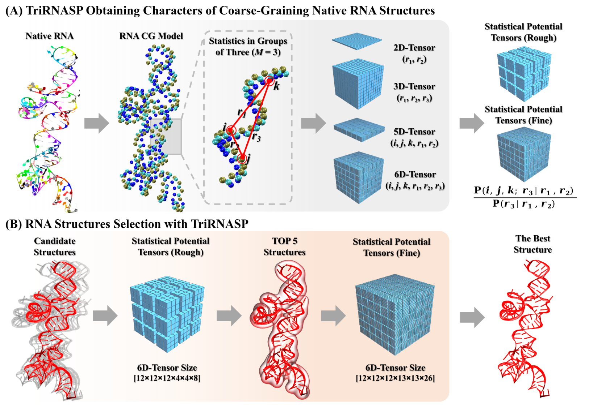

# TriRNASP

**TriRNASP** — by *Tan-group, Wuhan University*  
*An efficient knowledge-based potential with three-body effect for accurate RNA 3D structure evaluation*

TriRNASP reads precomputed energy tables and atom type definitions from the `Energy/` folder, processes `.pdb` structures from a given directory, and outputs the lowest-energy candidates.

[](https://github.com/Tan-group/TriRNASP/releases)

---

## 🔧 Build & Installation

### ✅ Recommended: Using Make

```bash
make
```
This will:
- Compile the executable **`TriRNASP`** with full optimization and OpenMP support
- Automatically extract bundled dataset archives (`*.zip`) if present

### 🛠️ Manual Build (Alternative)

If you prefer to compile manually without `make`, run:

```bash
gcc -O3 -march=native -ffast-math -fno-math-errno -fopenmp \
    -Wall -Wextra -Wa,--noexecstack -Wl,-z,noexecstack \
    TriRNASP.c -lm -o TriRNASP
```

**Build requirements:**
- GCC with OpenMP support
- Linux/Unix environment

**Optional:**
- `-march=native` enables architecture-specific optimization
- `-ffast-math -fno-math-errno` improves speed of math operations

---

## 📂 Input Files

Before running, ensure the following exist:

1. **Energy folder (`Energy/`)**
   - `Energy/Rough.energy`
   - `Energy/Fine.energy`

   These contain the precomputed energy tables.

2. **Structure directory**
   - A folder with `.pdb` files (RNA structures)
   - Example: `./example/`

⚠️ Official benchmark sets are available from the [GitHub Releases](https://github.com/Tan-group/TriRNASP/releases) page.

---

## 🚀 Usage

Run TriRNASP on a directory of `.pdb` files:

```bash
./TriRNASP <structure_directory>
```
Example:
```bash
./TriRNASP ./example
```
The program scans `.pdb` files, computes three-body energies, and prints the **top 5 lowest-energy structures**.

---

## 📊 Example Output

```bash
./TriRNASP ./example
Scanning directory: example/
Found PDBs: 182
R1205.pdb           -447.1199
R1205TS481_2.pdb    -391.5487
R1205TS481_1.pdb    -425.6724
R1205TS481_3.pdb    -292.6572
R1205TS481_4.pdb    -364.9655
Wall-clock time: 0.81 seconds
```

---

## ⚡ Batch Processing with `batch.sh`

For large datasets containing many subfolders:

```bash
./batch.sh
```

This script:
- Traverses all subfolders under `Test_sets/`
- Runs **TriRNASP** for each directory
- Saves results in `results_energy/`
- Logs failed directories and crashed PDBs

Enable parallel execution by editing `batch.sh`:
```bash
JOBS=$(nproc)
```
This uses all CPU cores.

---

## ⚙️ Adjustable Parameters

At the top of **`TriRNASP.c`**:
```c
#define num     10000  // Max number of PDB files per directory
#define path_l  300    // Max path length
```
Reduce `num` if your dataset has fewer structures to save memory and avoid stack overflow.

---

## 🧹 Clean Build

```bash
make clean
```
Removes object files and the executable.

---

## 🧠 Notes

- `.pdb` files must follow the standard PDB format.
- All required files must exist in `Energy/`.
- OpenMP is enabled by default for multicore performance.

---

## 📬 Contact
📧 **zjtan@whu.edu.cn**

---

## 📖 Citation
```
Tovi Yuen, En Lou, Zouchenyu Zhou, Ya-Lan Tan, Zhi-jie Tan. 2025.
TriRNASP: An efficient knowledge-based potential with three-body effect for accurate RNA 3D structure evaluation.
